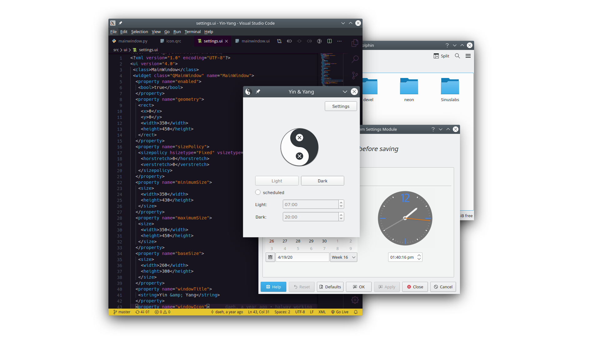
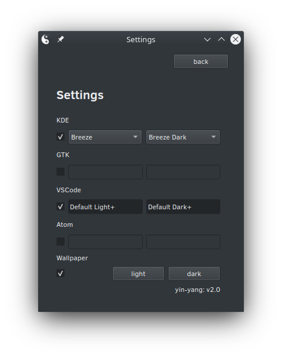

#  Yin-Yang

Auto Night-mode for Linux, it supports popular Desktops like
KDE, Gnome, Budgie and also themes your favourite Editors like VSCode or Atom. 





## Features

* Adjust your theme based on time or switch if sun rises or sets on your local position
* Works on Gnome, Budgie and KDE
* Toggle themes between light and dark
* Supports next to your system many applications like VsCode, Atom, Konsole and many more


## Installation
To install Yin-Yang copy the command below and follow the onscreen Instructions:

```
git clone https://github.com/daehruoydeef/Yin-Yang && cd Yin-Yang && sh ./scripts/install.sh
```

You will need some dependencies for the installation process to work correctly check the Wiki for what is needed:
[](<https://github.com/daehruoydeef/Yin-Yang/wiki>)



## Documentation

Want to know more? Visit the Wiki and read about Installation, Building, Troubleshooting and more.

[](<https://github.com/daehruoydeef/Yin-Yang/wiki>)


## Thanks to all Contributors 

This project exists thanks to all the people who [contribute](./.github/CONTRIBUTING.md).

[](https://github.com/daehruoydeef/Yin-Yang/graphs/contributors)
